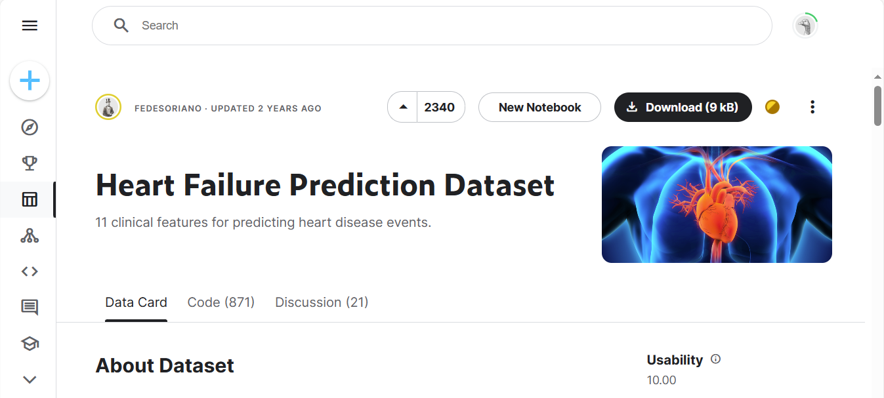

## Description

## Data Query

The data was directly downloaded from kaggle www.kaggle.com. The following steps show the querying process.

### Step 1

Go to www.kaggle.com. Click **Sign in** or **Register**.

### Step 2

After successfully logging into kaggle, go to https://www.kaggle.com/datasets/fedesoriano/heart-failure-prediction.

### Step 3

Click **Download(9kb)**.

