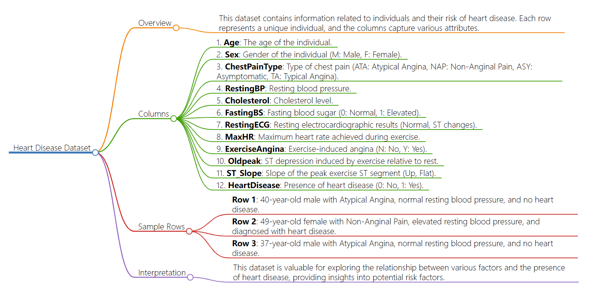

# Data

## Description 
This dataset presents a comprehensive overview of undergraduates across diverse programs at a higher education institution. It encompasses demographic details, socio-economic indicators, and academic performance data, facilitating an analysis of potential factors influencing student dropout and success. The dataset comprises disparate databases with pertinent information recorded at enrollment, covering application mode, marital status, chosen courses, and more. Moreover, it allows the estimation of overall student performance each semester, considering credited/enrolled/evaluated/approved curricular units and their corresponding grades. Additionally, regional unemployment rate, inflation rate, and GDP offer insights into how economic factors impact student outcomes. This robust analytical tool sheds light on motivations behind students' persistence or abandonment across disciplines like agronomy, design, education, nursing, journalism, management, social service, and technology.

## Data dictionary
| Variable        | Definition                                          | Description                                         | Frequency     | Range                | Unit        | Type      |
|-----------------|-----------------------------------------------------|-----------------------------------------------------|---------------|----------------------|-------------|-----------|
| Age             | The age of the individual                           | The age of the person in years                      | Continuous    | 32 to 66 years        | Years       | Numerical |
| Sex             | The gender of the individual                        | Male (M) or Female (F)                             | Categorical   | M, F                 | Category    | Categorical |
| ChestPainType   | Type of chest pain experienced                      | ATA (Typical Angina), NAP (Atypical Angina), ASY (Non-Anginal Pain), TA (Typical Angina) | Categorical   | ATA, NAP, ASY, TA    | Category    | Categorical |
| RestingBP       | Resting blood pressure                               | Blood pressure measured at rest                     | Continuous    | 100 to 170 mm Hg     | mm Hg       | Numerical |
| Cholesterol     | Cholesterol levels                                   | Serum cholesterol in mg/dl                          | Continuous    | 100 to 529 mg/dl     | mg/dl       | Numerical |
| FastingBS       | Fasting blood sugar level                            | Fasting blood sugar > 120 mg/dl (1 = true; 0 = false) | Binary        | 0, 1                 | Category    | Binary    |
| RestingECG      | Resting electrocardiographic results                | Normal, ST-T wave abnormality (ST), Left ventricular hypertrophy (LVH) | Categorical   | Normal, ST, LVH      | Category    | Categorical |
| MaxHR           | Maximum heart rate achieved                         | Maximum heart rate during exercise                 | Continuous    | 82 to 184 BPM        | BPM         | Numerical |
| ExerciseAngina  | Exercise-induced angina                             | Presence (Y) or absence (N) of exercise-induced angina | Binary        | Y, N                | Category    | Binary    |
| Oldpeak         | ST depression induced by exercise relative to rest  | The degree of ST depression                         | Continuous    | 0 to 4               | Dimensionless | Numerical |
| ST_Slope        | ST segment slope during exercise                    | Up, Flat                                            | Categorical   | Up, Flat             | Category    | Categorical |
| HeartDisease    | Presence or absence of heart disease                 | Presence (1) or absence (0) of heart disease        | Binary        | 0, 1                 | Category    | Binary    |
## Sample Observation

| Age | Sex | ChestPainType | RestingBP | Cholesterol | FastingBS | RestingECG | MaxHR | ExerciseAngina | Oldpeak | ST_Slope | HeartDisease |
|-----|-----|---------------|-----------|-------------|-----------|------------|-------|-----------------|---------|----------|--------------|
| 40  | M   | ATA           | 140       | 289         | 0         | Normal     | 172   | N               | 0       | Up       | 0            |

## Flowchart

## Citation
- FEDESORIANO. 2021. “Heart Failure Prediction Dataset.” www.kaggle.com. 2021. https://www.kaggle.com/datasets/fedesoriano/heart-failure-prediction.

