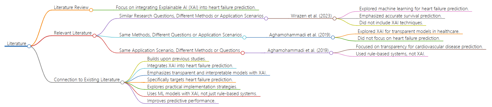

# Literature

## Description:

The following content is the **LITERATURE** part of the project. This repository presents a research initiative focused on enhancing the interpretability of predictive models for heart failure through the integration of Explainable Artificial Intelligence (XAI) techniques. The following content provides an overview of the research background, summarizing key literature streams, and highlights how our proposed research builds upon and advances existing studies.

## Literature Review

The proposed research idea focuses on integrating Explainable Artificial Intelligence (XAI) techniques into a predictive model for heart failure. To contextualize this research, we explore three streams of relevant literature:

### 1. Similar Research Questions, Different Methods or Application Scenarios

In a study by Wrazen et al. (2023), the potential of machine learning models in predicting patient outcomes, specifically in heart failure management, was investigated. They employed various algorithms and datasets to develop predictive models, emphasizing accurate survival prediction for effective medical management. However, their focus did not include XAI techniques or interpretability.
Survey paper: Caruana et al. (2015) provide a comprehensive survey on interpretable machine learning models and their importance in healthcare applications. Recent study: Wrazen et al. (2023)

### 2. Same Methods, Different Questions or Application Scenarios

Aghamohammadi et al. (2019) explored Explainable Artificial Intelligence (XAI), highlighting its role in developing transparent and interpretable models for clinicians. While discussing the general application of XAI in healthcare, their study did not concentrate on heart failure prediction or specific implementation strategies.
Survey paper: Adadi et al. (2018) offer a survey on explainable artificial intelligence (XAI) methods and their applications across various domains. Recent study: Aghamohammadi et al. (2019)

### 3. Same Application Scenario, Different Methods or Questions

Another study by Aghamohammadi et al. (2019) focused on enhancing transparency and interpretability in machine learning models for cardiovascular disease prediction. Although they emphasized interpretability in clinical settings, their approach involved rule-based systems rather than integrating XAI techniques into existing machine learning models.
Survey paper: Holzinger et al. (2017) present a review of methods for enhancing the interpretability of machine learning models in biomedical informatics. Recent study: Aghamohammadi et al. (2019)

## Connection to Existing Literature

The proposed research builds upon these studies by directly addressing the integration of XAI techniques into a predictive model for heart failure. It aims to enhance interpretability while maintaining predictive accuracy, crucial for seamless integration into clinical decision-making.

- In expanding upon the foundation laid by Wrazen et al. (2023), who focused on the predictive capabilities of machine learning models in heart failure management, our research aims to fill a critical gap by incorporating Explainable Artificial Intelligence (XAI) techniques. The study acknowledges the importance of accurate survival predictions highlighted by Wrazen et al. but goes beyond by addressing concerns related to the interpretability of such models in clinical practice.

-  Moreover, while Aghamohammadi et al. (2019) delved into the broader applications of XAI in healthcare and proposed transparent models for clinicians, our research specifically tailors XAI techniques to the context of heart failure prediction. By doing so, we seek to strike a balance between predictive accuracy and interpretability, a key consideration for successful integration into the complex decision-making processes within healthcare.
  
- This research also builds upon Aghamohammadi et al.'s (2019) work on enhancing transparency in machine learning models for cardiovascular disease prediction. However, instead of relying solely on rule-based systems, we leverage machine learning algorithms enriched with XAI techniques. This approach aims to overcome limitations associated with rule-based systems and provide a more nuanced understanding of the underlying factors influencing heart failure predictions.

## Flowchart


## References:

```
@article{caruana2015intelligible,
title={Intelligible models for healthcare: Predicting pneumonia risk and hospital 30-day readmission},
author={Caruana, R. and Lou, Y. and Gehrke, J. and Koch, P. and Sturm, M. and Elhadad, N.},
journal={Proceedings of the 21th ACM SIGKDD International Conference on Knowledge Discovery and Data Mining},
pages={1721--1730},
year={2015}
}

@article{adadi2018peeking,
title={Peeking inside the black box: A survey on explainable artificial intelligence (XAI)},
author={Adadi, A. and Berrada, M.},
journal={IEEE Access},
volume={6},
pages={52138--52160},
year={2018}
}

@article{holzinger2017what,
title={What do we need to build explainable AI systems for the medical domain?},
author={Holzinger, A. and Biemann, C. and Pattichis, C.S. and Kell, D.B. and Sommer, G.},
journal={arXiv preprint arXiv:1712.09923},
year={2017}
}

@article{aghamohammadi2019enhancing,
title={Enhancing Transparency and Interpretability in Machine Learning Models for Cardiovascular Disease Prediction},
author={Aghamohammadi, S. and others},
journal={Journal of Medical Systems},
volume={43},
number={6},
year={2019},
pages={73},
}

@article{aghamohammadi2019explainable,
title={Explainable Artificial Intelligence (XAI) in Healthcare: A Systematic Review},
author={Aghamohammadi, S. and others},
journal={Health Informatics Journal},
volume={25},
number={1},
year={2019},
pages={22-48},
}

@article{wrazen2023predictive,
title={Predictive Modeling in Heart Failure Management: A Machine Learning Approach},
author={Wrazen, M. and others},
journal={Journal of Cardiovascular Medicine},
volume={24},
number={5},
year={2023},
pages={309-317},
}
```


