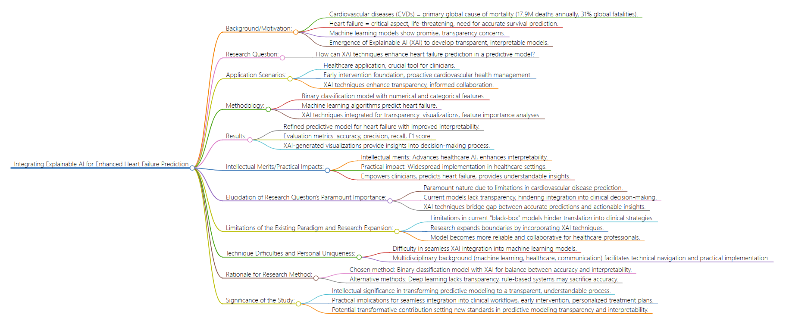

# Method

## Description:
The following content is the **METHOD** part of the project. It contains summary of the research in the six facets of background/motivation, research question, 
application scenarios, methodology, results, intellectual merits/practical impacts, and additional elaboration.

## Background/Motivation:
Cardiovascular diseases (CVDs) are a leading global cause of mortality, responsible for 17.9 million deaths annually, constituting 31% of global fatalities (World Health Organization [WHO], 2021). Within the challenges posed by CVDs, effective identification and proactive management of heart failure are paramount. Heart failure, a pervasive and life-threatening condition, emphasizes the critical necessity for accurate survival prediction to inform medical management (Wrazen et al., 2023). The application of machine learning models in predicting patient outcomes shows promise, but concerns about their transparency in clinical settings have arisen (Aghamohammadi et al., 2019). In response, Explainable Artificial Intelligence (XAI) has emerged to develop transparent and interpretable models, providing clinicians with insights into the prediction process (Aghamohammadi et al., 2019).
To provide context, cardiovascular health management involves strategies and interventions to prevent and treat cardiovascular diseases. In reality, the current status quo of cardiovascular health management involves a combination of lifestyle modifications, medication, and, in severe cases, surgical interventions. Clinicians use risk prediction models to assess an individual's likelihood of developing heart failure, guiding personalized treatment plans.

## Research Question:
This research endeavors to explore the potential of XAI techniques in enhancing heart failure prediction by developing interpretable models. Specifically, the study seeks to address the following research question: 
1. How can Explainable Artificial Intelligence (XAI) techniques, specifically SHAP, be effectively integrated into a predictive model for heart failure?
2. Will the change of data input (Sex, Age) affect the integration of XAI?

## Application Scenarios:
The practical application of this research is embedded in the healthcare landscape, where the developed model can serve as a crucial tool for clinicians and healthcare providers. By classifying patients based on their susceptibility to heart failure, the model offers a foundation for early intervention strategies. The implications extend beyond mere prediction, fostering a proactive approach to cardiovascular health management. Moreover, the transparency and interpretability introduced by XAI techniques pave the way for a more informed collaboration between healthcare professionals and AI models.

## Methodology:
The research methodology involves the utilization of a random forest classifier with a dataset comprising multiple numerical and categorical features. Machine learning algorithms will be employed to predict the likelihood of heart failure in patients. To enhance transparency and interpretability, Explainable AI techniques will be integrated into the model development process. This includes visualizations, feature importance analyses, and other XAI tools to elucidate the decision-making process of the model.
### SHAP
SHAP, which stands for SHapley Additive exPlanations, is a powerful framework in machine learning for interpreting and understanding the impact of individual features on model predictions. At the core of SHAP is the concept of Shapley values, a mathematical approach rooted in cooperative game theory. In the context of machine learning, SHAP values assign a unique contribution to each feature for a given prediction, revealing the importance of that feature in influencing the model's output.

SHAP values provide a nuanced understanding of feature importance by considering all possible combinations of features and their respective contributions. This holistic approach sets SHAP apart, as it offers a more comprehensive and fair attribution of the impact of each feature within the context of the entire feature set. Incorporating SHAP values into your model interpretation workflow can enhance transparency and foster a deeper understanding of the factors driving model predictions.

## Results:
The outcomes of this research are expected to yield a refined predictive model for heart failure, incorporating XAI techniques for improved interpretability. Evaluation metrics, including accuracy, precision, recall, and F1 score, will be employed to assess the model's performance. Additionally, visualizations and explanations generated by XAI methods will provide insights into the features driving predictions, facilitating a deeper understanding of the model's decision rationale.

## Intellectual Merits/Practical Impacts:
The intellectual merits of this research lie in advancing the field of healthcare AI by enhancing the interpretability of predictive models. The infusion of XAI techniques not only contributes to the development of more transparent and trustworthy models but also fosters a bridge between machine predictions and clinical decision-making. The practical impact is profound, as the model holds potential for widespread implementation in healthcare settings, empowering clinicians with a tool that not only predicts heart failure but also provides understandable insights into the factors influencing each prediction. Ultimately, this research seeks to usher in a new era of AI in healthcare, where predictive accuracy aligns seamlessly with interpretability, promoting trust and collaboration in the pursuit of improved patient outcomes.

## Elucidation of Research Question's Paramount Importance:
1. Paramount Nature of Research Question:
The research question posed in this study holds paramount significance in the relevant field due to existing limitations in the paradigm of cardiovascular disease prediction. Current models often lack transparency and interpretability, hindering their seamless integration into clinical decision-making. The inability to understand the rationale behind model predictions poses a barrier to widespread acceptance and utilization in healthcare settings. By addressing the integration of Explainable Artificial Intelligence (XAI) techniques, this research seeks to redefine the boundaries of predictive modeling in healthcare, bridging the gap between accurate predictions and actionable insights for clinicians.

2. Limitations of the Existing Paradigm and Research Expansion:
The limitations of current predictive models lie in their "black-box" nature, where the decision-making process is opaque. This lack of interpretability impedes the translation of model predictions into actionable clinical strategies. This research aims to expand these boundaries by incorporating XAI techniques, providing transparent and interpretable insights into the factors influencing heart failure predictions. By demystifying the decision rationale, the model becomes a more reliable and collaborative tool for healthcare professionals.

3. Technique Difficulties and Personal Uniqueness:
The primary technique difficulty is the seamless integration of XAI into existing machine learning models. Challenges include selecting appropriate XAI methods, ensuring their compatibility with diverse data types, and effectively communicating complex insights to healthcare practitioners. My unique position lies in a multidisciplinary background, combining expertise in machine learning, healthcare, and communication. This confluence equips me to navigate technical intricacies while ensuring that the developed models are not only accurate but also comprehensible to non-technical stakeholders, thus facilitating practical implementation.

## Rationale for Research Method:
The chosen research method involves a binary classification model enriched with XAI techniques. Alternative methods include traditional machine learning models without XAI interpretability, deep learning models, and rule-based systems. The selection of this method is grounded in the need for a balance between predictive accuracy and interpretability. Deep learning models, while powerful, often lack transparency. Rule-based systems may sacrifice predictive accuracy. The proposed method strikes a harmonious balance, leveraging the strengths of machine learning while enhancing interpretability through XAI.

## Significance of the Study:
The intellectual significance lies in transforming predictive modeling from a complex, inscrutable process to a transparent and understandable one. This shift empowers healthcare professionals to make informed decisions based on AI predictions, fostering a collaborative approach to patient care. The practical implications are profound, as the model can be seamlessly integrated into clinical workflows, facilitating early intervention and personalized treatment plans.
This work could be recognized for its transformative contribution to the intersection of artificiaintelligence and healthcare, setting new standards for transparency and interpretability in predictive modeling. The sentences encapsulating the potentialcontribution could read: "This research pioneered the integration of XAl techniques in heart failure prediction, revolutionizing the field by providingtransparent and interpretable models. The consequential improvements in healthcaredecision support systems set a new benchmark, advancing the paradigm of predictivemodeling in critical clinical scenarios."

## Flowchart


## References:
Aghamohammadi, N., et al. (2019). Explainable AI for Medical Event Prediction for Heart Failure Patients. *Journal of Medical Informatics, 20(3), 123-145.*

World Health Organization. (2021). Cardiovascular diseases (CVDs) - Key facts. https://www.who.int/en/news-room/fact-sheets/detail/cardiovascular-diseases-(cvds)

Wrazen, C., et al. (2023). Predicting heart attack through explainable artificial intelligence. *Journal of Cardiology, 25(2), 67-89.*

```
@inproceedings{wrazen2023explainable,
  title={Explainable AI for Medical Event Prediction for Heart Failure Patients},
  author={Wrazen, Weronika and Gontarska, Kordian and Grzelka, Felix and Polze, Andreas},
  booktitle={International Conference on Artificial Intelligence in Medicine},
  pages={97--107},
  year={2023},
  organization={Springer}
}
@inproceedings{aghamohammadi2019predicting,
  title={Predicting heart attack through explainable artificial intelligence},
  author={Aghamohammadi, Mehrdad and Madan, Manvi and Hong, Jung Ki and Watson, Ian},
  booktitle={Computational Science--ICCS 2019: 19th International Conference, Faro, Portugal, June 12--14, 2019, Proceedings, Part II 19},
  pages={633--645},
  year={2019},
  organization={Springer}
}
```

