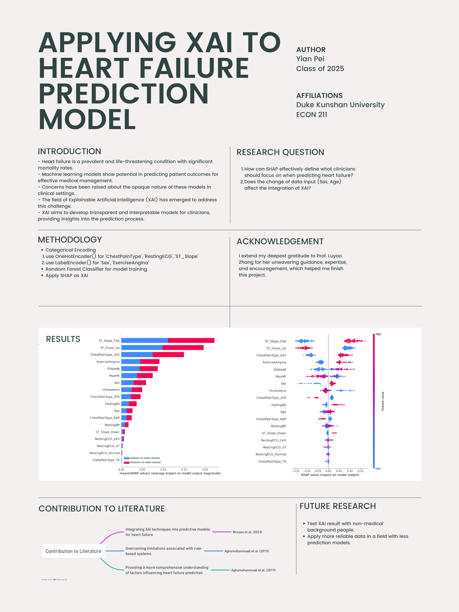
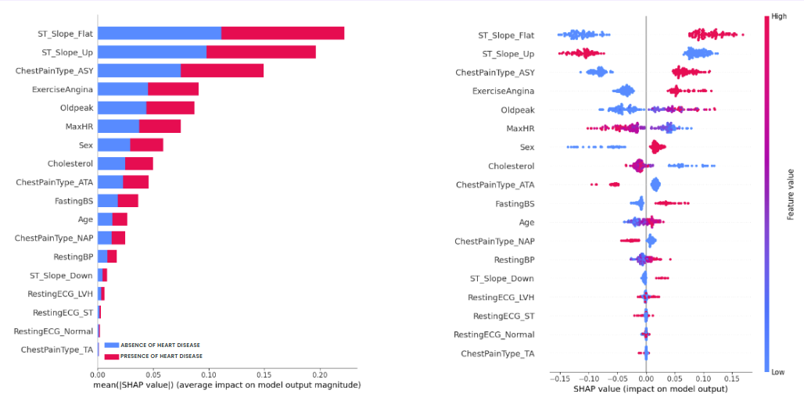
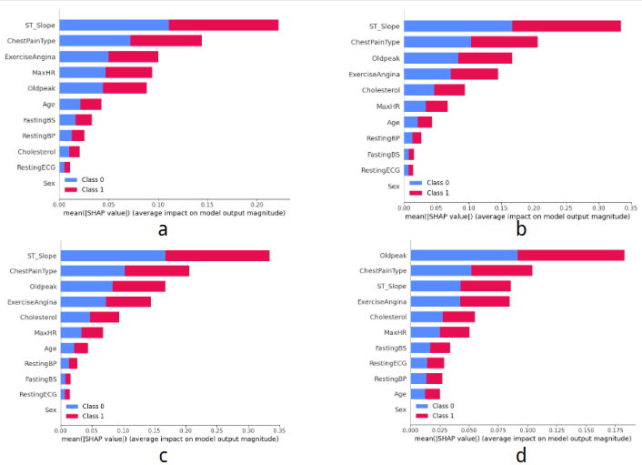

# Applying XAI to Heart Failure Prediction Model

## Project information
- **Author**: Yian Pei, Applied Math - Computer science, Class of 2025, Duke Kunshan University
- **Instructor**: Prof. Luyao Zhang, Duke Kunshan University
- **Disclaimer**: Submissions to the Final Project for [Econ211 Intelligent Economy, 2023 Autumn Term (Seven Week - Second)](https://ms.pubpub.org/) instructed by Prof. Luyao Zhang at Duke Kunshan University.
- **Acknowledgments**: I extend my deepest gratitude to Prof. Luyao Zhang, Yiwei Liang, Jiaolun Zhou, Zhe Niu, Enzo Rovira and Zakhar Merinov for their unwavering guidance, expertise, and encouragement, which helped me finish this project.

- **Project Summary**: 
  - This project aims to improve heart failure prediction by integrating Explainable Artificial Intelligence (XAI) techniques into a binary classification model. Focused on healthcare, the research utilizes machine learning algorithms and a diverse dataset to enhance transparency and interpretability. The outcomes are expected to yield a refined predictive model, fostering collaboration between healthcare professionals and AI. The intellectual merits lie in advancing healthcare AI, offering transparent and trustworthy models, while the practical impact empowers clinicians with a tool that predicts heart failure and provides understandable insights for improved patient outcomes.

    Research questions:
  - How can SHAP effectively define what clinicians should focus on when predicting heart failure?
  - Will the change of data input (Sex, Age) affect the integration of XAI?

## Table of Contents

1. [**Poster and Project Summary**](./Poster-and-Project-Summary)
2. [**Literature**](./Literature)
3. [**Method**](./Method)
4. [**Data**](./Data)
    - 4.1 [Queried-Data](./Data/Queried-Data)
    - 4.2 [Processed-Data](./Data/Processed-Data)
5. [**Code**](./Code)
    - 5.1 [Data-Analysis](./Code/Data-Analysis)
    - 5.2 [Data-Query](./Code/Data-Query)
6. [**Results**](./Results)
7. [**Spotlights**](./Spotlights)
8. **More about the Author**
9. **References**

## Literature
The proposed research addresses the integration of Explainable Artificial Intelligence (XAI) techniques into heart failure predictive models, building on three literature streams. Firstly, Wrazen et al. (2023) explored machine learning in heart failure but lacked XAI focus. Caruana et al. (2015) surveyed interpretable ML, highlighting healthcare relevance. Secondly, Aghamohammadi et al. (2019) emphasized XAI in healthcare, not specific to heart failure. Adadi et al. (2018) surveyed XAI methods generally. Lastly, Aghamohammadi et al. (2019) enhanced transparency for cardiovascular predictions, but not integrating XAI into existing models. Holzinger et al. (2017) surveyed interpretability methods.

The proposed research extends Wrazen et al. (2023), emphasizing accurate survival predictions with added XAI for interpretability. It refines Aghamohammadi et al.'s (2019) broad XAI application to a heart failure context. Unlike their rule-based approach, this research leverages ML enriched with XAI, aiming for nuanced insights and a balance between accuracy and interpretability in clinical decision-making.
## Method
The research methodology involves the utilization of a random forest classifier with a dataset comprising multiple numerical and categorical features. Machine learning algorithms will be employed to predict the likelihood of heart failure in patients. To enhance transparency and interpretability, Explainable AI techniques will be integrated into the model development process. This includes visualizations, feature importance analyses, and other XAI tools to elucidate the decision-making process of the model.

The dataset was divided into 4 parts: Male above average age, Male below average age, Female above average age, Female below average age. The SHAP analysis will be compared.
## Data
The dataset contains information on individuals' health parameters, with columns representing different attributes. These include Age, Sex, Chest Pain Type (ATA, NAP, ASY, TA), Resting Blood Pressure (RestingBP), Cholesterol levels, Fasting Blood Sugar (FastingBS), Resting Electrocardiographic Results (RestingECG), Maximum Heart Rate (MaxHR), Exercise-Induced Angina (ExerciseAngina), ST depression induced by exercise relative to rest (Oldpeak), ST segment slope (ST_Slope), and the presence or absence of Heart Disease (HeartDisease).
Each row corresponds to a unique individual, providing a snapshot of their health profile. The data appears to capture diverse information such as age, gender, cardiovascular symptoms, and various physiological measurements. The dataset is likely intended for analysis to identify patterns or factors associated with the presence of heart disease.
## Code
The Code contains data preprocessing, model training, and applying SHAP to model.
## Result
The results indicate that SHAP effectively defines key factors for clinicians to focus on when predicting heart failure. The analysis of feature influence highlights the significance of ST_Slope_Up and ChestPainType_ASY in predicting heart failure, with clear guidance for clinicians to prioritize these factors. The subsequent recommendations for clinical focus, elucidated in the context of ST_Slope, ChestPainType, ExerciseAngina, and Oldpeak, provide actionable insights. Furthermore, the interpretability of these features is expounded, aiding clinicians in understanding the implications of flat ST segments, asymptomatic chest pain, lack of exercise, and elevated oldpeak values. The second question explores the impact of changing data inputs (Sex, Age) on the integration of explainable artificial intelligence (XAI), revealing distinct patterns across gender and age groups. The observed variations are attributed to both biological differences and potential model and data flaws. Despite these nuances, the recommended focus areas for clinicians remain consistent, emphasizing the importance of ST_Slope, ChestPainType, ExerciseAngina, Oldpeak, and MaxHR in predicting heart failure.
## Spotlight

<div align="center">
  


**Figure 1: Poster**



**Figure 2: Result for first question**



**Figure 3: Result for second question**
</div>

## More about the Author


### **Self Introduction**
Hello, I am Yian Pei, a passionate and dedicated individual currently pursuing a dual degree program at Duke Kunshan University (DKU) and Duke University, set to graduate in July 2025. My academic journey has been complemented by valuable research experiences and a commitment to personal and professional growth.

### **Intellectual Growth**

Throughout this course, I've experienced substantial intellectual growth, particularly in understanding the profound impact of applying machine learning to address global issues like cardiovascular diseases (CVDs). My exploration into Explainable Artificial Intelligence (XAI) and its role in enhancing heart failure prediction has illuminated the significance of transparency in the clinical application of predictive models. The magic of interdisciplinary research lies in its ability to weave together diverse perspectives, paving the way for innovative solutions that can truly make a difference in people's lives.

### **Professional Growth**

Professionally, my journey has been enriched by valuable experiences, from a research stint at the Suzhou Institute of Nano-Tech and Nano-Bionics to an Algorithm Engineer Internship at Ainstec. These experiences, coupled with my role as a Student Research Intern in Bioinformatics, have equipped me with a versatile skill set crucial for navigating the complex intersection of healthcare and artificial intelligence. The course has been instrumental in shaping my ability to integrate skills effectively, creating a robust professional profile poised for meaningful contributions.

### **Living a Purposeful Life**

Envisioning the future, I aspire to be a pioneer in the field, contributing to advancements recognized globally. Winning the Nobel Prize or Turing Award is not just a personal dream; it's a testament to the impact I hope to make. My feature sentence reflects a commitment to interdisciplinary research: "Yian Pei, a catalyst for change in healthcare and technology, revolutionized the application of machine learning to predict and prevent cardiovascular diseases, advancing human civilization."

My purpose is to be the founding figure of transformative advancements, leaving a legacy that positively influences the intersection of artificial intelligence and healthcare.

### **Final Reflections**

In conclusion, this course has been a transformative journey, fostering both intellectual and professional growth. The interdisciplinary nature of the curriculum has broadened my horizons, and the research on XAI techniques in heart failure prediction aligns seamlessly with my vision of applying AI for societal well-being. As I embark on future endeavors, I am excited about the prospect of making meaningful contributions to healthcare, guided by the principles of transparency, collaboration, and purpose.

## References

### Data Source

- [Kaggle](https://www.kaggle.com/datasets/fedesoriano/heart-failure-prediction)

### Articles

- [Cardiovascular diseases (CVDs) - Key facts](https://www.who.int/en/news-room/fact-sheets/detail/cardiovascular-diseases-(cvds))

### Literature

Caruana, R., Lou, Y., Gehrke, J., Koch, P., Sturm, M., & Elhadad, N. (2015). "Intelligible models for healthcare: Predicting pneumonia risk and hospital 30-day readmission." Proceedings of the 21th ACM SIGKDD International Conference on Knowledge Discovery and Data Mining, 1721-1730.

Adadi, A., & Berrada, M. (2018). "Peeking inside the black box: A survey on explainable artificial intelligence (XAI)." IEEE Access, 6, 52138-52160.

Holzinger, A., Biemann, C., Pattichis, C.S., Kell, D.B., & Sommer, G. (2017). "What do we need to build explainable AI systems for the medical domain?" arXiv preprint arXiv:1712.09923.

Aghamohammadi, S., et al. (2019). "Enhancing Transparency and Interpretability in Machine Learning Models for Cardiovascular Disease Prediction." Journal of Medical Systems, 43(6), 73.

Aghamohammadi, S., et al. (2019). "Explainable Artificial Intelligence (XAI) in Healthcare: A Systematic Review." Health Informatics Journal, 25(1), 22-48.

Wrazen, M., et al. (2023). "Predictive Modeling in Heart Failure Management: A Machine Learning Approach." Journal of Cardiovascular Medicine, 24(5), 309-317.

```
@article{caruana2015intelligible,
title={Intelligible models for healthcare: Predicting pneumonia risk and hospital 30-day readmission},
author={Caruana, R. and Lou, Y. and Gehrke, J. and Koch, P. and Sturm, M. and Elhadad, N.},
journal={Proceedings of the 21th ACM SIGKDD International Conference on Knowledge Discovery and Data Mining},
pages={1721--1730},
year={2015}
}

@article{adadi2018peeking,
title={Peeking inside the black box: A survey on explainable artificial intelligence (XAI)},
author={Adadi, A. and Berrada, M.},
journal={IEEE Access},
volume={6},
pages={52138--52160},
year={2018}
}

@article{holzinger2017what,
title={What do we need to build explainable AI systems for the medical domain?},
author={Holzinger, A. and Biemann, C. and Pattichis, C.S. and Kell, D.B. and Sommer, G.},
journal={arXiv preprint arXiv:1712.09923},
year={2017}
}

@article{aghamohammadi2019enhancing,
title={Enhancing Transparency and Interpretability in Machine Learning Models for Cardiovascular Disease Prediction},
author={Aghamohammadi, S. and others},
journal={Journal of Medical Systems},
volume={43},
number={6},
year={2019},
pages={73},
}

@article{aghamohammadi2019explainable,
title={Explainable Artificial Intelligence (XAI) in Healthcare: A Systematic Review},
author={Aghamohammadi, S. and others},
journal={Health Informatics Journal},
volume={25},
number={1},
year={2019},
pages={22-48},
}

@article{wrazen2023predictive,
title={Predictive Modeling in Heart Failure Management: A Machine Learning Approach},
author={Wrazen, M. and others},
journal={Journal of Cardiovascular Medicine},
volume={24},
number={5},
year={2023},
pages={309-317},
}
```

