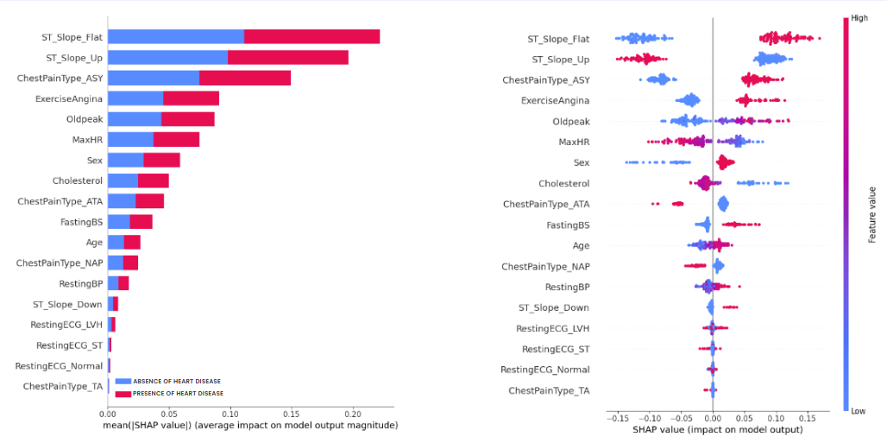

## Description
This section describes how the research answers each research question based on the specific methods.

## Results

### How can SHAP effectively define what clinicians should focus on when predicting heart failure?

**Figure 1: Result for first question**

The chart illustrates how each feature influences our predictions. The horizontal axis indicates whether a feature's value contributes positively (shown in red) or negatively (shown in blue) to the prediction. Meanwhile, the vertical axis represents the level of contribution from each feature.

For instance, observing the chart reveals that as the target variable increases (moves to the right), the MaxHR (Maximum Heart Rate) distribution becomes bluer, indicating a negative correlation between the target variable and MaxHR. Similarly, there is a positive correlation between the target variable and Oldpeak, as evident from the chart.

The contribution of ST_Slope_Up and ChestPainType_ASY to heart failure are the highest two.

### Result

**Clinicians should focus on**

**1st** ST_Slope: if the slope of the peak exercise ST segment is flat.

**2nd** ChestPainType: if the patient has an asymptomatic type of chest pain.

**3rd** ExerciseAngina: if the patient does not exercise

**4th** Oldpeak: if a patient has a high oldpeak (oldpeak = ST [Numeric value measured in depression])

If patient show some of these symptoms, the clinicians could explain: You have a high possibilty of heart failure because eg. your ST_Slope is flat.

For further explainability, here is definition.

**ST_Slope**: If the slope of the peak exercise ST segment is flat:

The ST segment is a portion of an electrocardiogram (ECG or EKG) that represents the interval between ventricular contraction and relaxation.
The slope of the ST segment during peak exercise can indicate the electrical activity of the heart.
If the slope is flat, it may suggest a certain pattern of heart activity. In the context of medical analysis, a flat ST segment during exercise might be associated with particular cardiovascular conditions.

**ChestPainType**: If the patient has an asymptomatic type of chest pain:

Chest pain types are often categorized based on their characteristics, and one type is "asymptomatic," meaning the patient does not experience noticeable or typical chest pain symptoms.
If a patient is classified as having asymptomatic chest pain, it implies they may not feel the usual discomfort or pain that is commonly associated with heart-related issues.

**ExerciseAngina**: If the patient does not exercise:

Angina refers to chest pain or discomfort caused by reduced blood flow to the heart muscle.
Exercise-induced angina occurs when physical activity increases the heart's demand for oxygen, revealing any insufficient blood supply.
If a patient does not exercise, it suggests that the assessment of chest pain during physical activity may not be applicable, and alternative methods might be needed to evaluate their heart condition.

**Oldpeak**: If a patient has a high oldpeak (oldpeak = ST [Numeric value measured in depression]):

Oldpeak is a measure of the depression of the ST segment on an ECG during exercise.
A higher oldpeak value indicates a greater deviation from the baseline, suggesting more significant ST segment depression during exercise.
In the context of heart health, a high oldpeak might be indicative of certain cardiac conditions, and it is a parameter used in medical assessments to evaluate the heart's response to physical stress.

### Does the change of data input (Sex, Age) affect the integration of XAI?

**Figure 2: Result for second question**
**a: Male below average age, b: Male above average age, c: Female below average age, d: Female above average age**

### Result

We can observe that the change of data input will affect the integration of XAI.

This could be due to:

**Biological Differences**:

Gender: Men and women often have different baseline physiological characteristics. For example, men tend to have larger heart sizes and different hormonal profiles than women. These differences can affect the way certain features contribute to predicting heart failure.

Age: As people age, their bodies undergo various changes, and the prevalence of certain risk factors for heart failure may vary. For instance, older individuals may be more likely to have issues like hypertension or coronary artery disease, which can influence the predictive features for heart failure.

**Model&Data flaw**

Figure 2.d has the biggest difference compared to others, as Oldpeak is the highest contributor. This could be due to the fact that Fabove (Female above) has a model of low roc score. And Fabove has a small dataset which may not be statistically representative of the population it aims to model.

Nevertheless, clinicians should still focus on:

**Clinicians should focus on**

ST_Slope: if the slope of the peak exercise ST segment is flat.

ChestPainType: if the patient has an asymptomatic type of chest pain.

ExerciseAngina: if the patient does not exercise

Oldpeak: if a patient has a high oldpeak (oldpeak = ST [Numeric value measured in depression])

and additionally: MaxHR: maximum heart rate achieved
